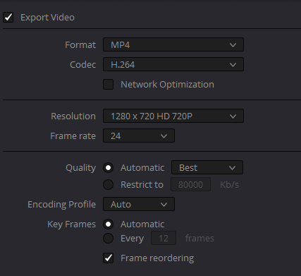

# Hope Leeds Automation Non Technical Readme

This contains some guidelines on editing/uploading the video. For the technical overview of this repo, go [here](README.md)

## Editing video
### General
1. Fade in/fade out
2. Music/song as appropriate
2. Leave plenty of black screen at the end of each section. 2/3 seconds is enough usually. (No need to delay at the start of the video. This will be the padding before the next video plays)
3. Add logo on the top right.
4. The logo should not fade in or fade out. This can be extended past the video to achieve no.1
```
For davinci resolve, the setting for the logo is:
Zoom: 0.1
X: 830  Y: 470
Opacity: 50%
```
You can get the logo here: https://hope-leeds-streaming.s3.us-west-000.backblazeb2.com/Hope+Leeds+Logo+Transparent.png

### Chairperson
Some list of what we normally add/edit:
- Chairperson name
- Scripture overlay
- Website info

### PW (Praise & Worship)
First we compile the various video into one.  
Then we'll need to add subtitle for it. The subtitle includes 2 language. However Davinci resolve doesn't support that. Instead, we normally use [Avidemux](http://avidemux.sourceforge.net/download.html) to include the subs.

Sometimes the sub(subtitle) have incorrect timing(maybe you render after trimming the start, etc). You can use https://subtitletools.com/subtitle-sync-shifter to shift the time of the subs.

So my normal editing process is:
- Sync video together
- Edit and render them with correct fade in/out, logo, etc
- Shift the subtitle(taking note of the timing before trimming the start when editing)
- Add the subtitle with avidemux

### Sermon / Teaching

We have a program to automatically edit the slides into the video given the video frames.  
Go to https://video-stream.michaelsalim.co.uk/ for a video player that shows the frame.

Similar to PW, it is good to edit the video first without the slides. And then we can time the slides on that and insert it afterwards.

## Audio
Most times the audio are not ideal. You can follow some step to make it slightly better. I use [Audacity](https://www.audacityteam.org/) to edit it.
- Compress & Normalize
- Amplify to desired volume
- Noise reduction

Ask me if you're not sure how to do this

## Rendering video

We're going to stream to facebook, so there's no point in rendering a video better than what facebook supports.  
You can find the guideline here:
https://www.facebook.com/help/1534561009906955?helpref=faq_content  
TL;DR: use **1280 x 720**  
Important!!! **24 FPS**(Yes, not 30)  
Good: **H264/MP4**  



At the end of the day, the stream should handle conversion, so it's not super important. But it'll save some storage.

## Uploading

If you're having trouble with uploading, you can try to upload it through youtube or http://upload-streaming.michaelsalim.co.uk/

> If it's the final video, please do upload it through http://upload-streaming.michaelsalim.co.uk/
