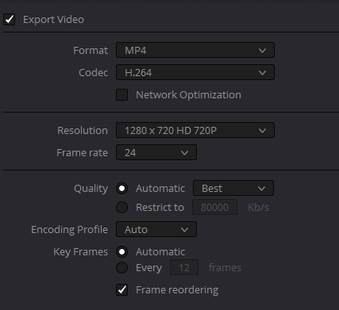

# Hope Leeds Automation

This will be a monorepo containing all sorts of code to help automate the sunday service suring COVID-19

## Upload B2

Contains the frontend and companion to allow upload to B2 storage.  
On the server, we can access it using s3fs (mount FUSE) to make it easy.  
`s3fs hope-leeds-streaming /mnt/b2 -o passwd_file=/.passwd -o url=https://s3.us-west-000.backblazeb2.com -o use_path_request_style`

## Running the stream
 TODO: Maybe new package?

## Editing video

1. Leave plenty of black screen at the end of each section. 2/3 seconds is enough usually. (No need to delay at the start of the video. This will be the padding before the next video plays)
2. Add logo on the top right.
```
For davinci resolve, the setting is:
Zoom: 0.1
X: 830  Y: 470
Opacity: 50%
```
You can get the logo here: https://hope-leeds-streaming.s3.us-west-000.backblazeb2.com/Hope+Leeds+Logo+Transparent.png

### Praise & Worship
Sometimes the subtitle timing needs to be shifted. I use https://subtitletools.com/subtitle-sync-shifter which works fine.

### Sermon Editing

We have a program to automatically edit the slides into the video given the video frames.  
Go to https://video-stream.michaelsalim.co.uk/ for a video player that shows the frame.

## Rendering video

We're going to stream to facebook, so there's no point in rendering a video better than what facebook supports.  
You can find the guideline here:
https://www.facebook.com/help/1534561009906955?helpref=faq_content  
TL;DR: use **1280 x 720**  
Important!!! **24 FPS**(Yes, not 30)  
Good: **H264/MP4**  



At the end of the day, the stream should handle conversion, so it's not super important. But it'll save some storage.

## Uploading

If you're having trouble with uploading, you can try to upload it through youtube or http://upload-streaming.michaelsalim.co.uk/

> If it's the final video, please do upload it through http://upload-streaming.michaelsalim.co.uk/
